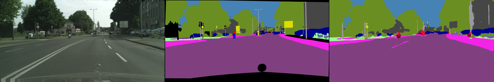

# DAAI Project3 
## Federated Semantic Segmentation for self-driving cars

-------
POLITECNICO DI TORINO

Automotive Engineering – A.Y. 2022-2023

Advisor: Tatiana Tommasi(tatiana.tommasi@polito.it), Eros Fanì (eros.fani@polito.it)

Student: s287660-Chuansong Zhang, s303293-Wei Li, s294616-Shuning Liu

-------

* ### PROJECT OVERVIEW AND GOALS
     The main objective of this project is to implement semantic segmentation(SS) tasks on self-driving vehicles based on the Federated Learning(FL) framework in terms of private requirements. We simulate and analyze the result in the context of autonomous vehicles to resemble real-world scenarios using the PyTorch library. In the end, we understand the difficulties and challenges of a more realistic scenario that contains quite a large size of samples without accurate labels to train the model. And consequently, we need to tackle a new task about source-Free Domain Adaptation applied to the Real-time Semantic Segmentation networks with the Federated learning framework (FFreeDA).
     
    Overall, we got familiar with the semantic segmentation networks and the motivations behind the federated learning framework and tried to handle the unsupervised domain adaptation(UDA) learning task for autonomous driving with the FFreeDA method in a real-world scenario.
* ### RESOURCES
     -  Download the datasets from [here](https://mega.nz/file/ERkiQBaY#h-wktK7U7MpIG5nf-rMWF7d76NEM5ae_MrAmELftNR0) and extract them.
     -  The datasets contain a subset of the Cityscapes[^1] dataset and a subset of GTA5 dataset.
     - The DATASET directory already contains two subdirectories (Cityscapes/GTA5), move the images/labels folder in each downloaded dataset into the subdirectory correspondingly.
     -  If you plan to perform your experiments on CoLab you should clone the whole upper files into your Google Drive account and upload the images/labels folder in each downloaded dataset into the DATASET directory correspondingly.

    [^1]: Send the application for the whole set of Cityscapes dataset from [here](https://www.cityscapes-dataset.com/login/)  if you want it.

* ### IMPLEMENTATION STEPS
  ####  1st STEP) PARTITION CITYSCAPES INTO TRAIN AND TEST
     - partition A:

          Test partition: 2 random images from each city 
          
          Train partition: the remaining images

     - partition B:

          Test partition: the list of images in val.txt 
          
          Train partition: the list of images in train.txt
  
  ####  2nd STEP) CENTRALIZED BASELINE
  
     Implement a centralized baseline using the BiSeNetV2 network for the aforementioned two A and B train/test partitions
  
  ####  3rd STEP) FEDERATED SEMANTIC SEGMENTATION EXPERIMENTS
  
     Build uniform (I) and heterogeneous (II) splits starting from the train partitions A and B. (no more than 20 images to each client.)
  
     Run FL+SS supervised experiments in the following configurations, using the FedAvg algorithm:
     - train/test partition A, split A.I 
     - train/test partition A, split A.II
     - train/test partition B, split B.I 
     - train/test partition B, split B.II

  ####  4th STEP) MOVING TOWARDS FFreeDA - PRE-TRAINING PHASE
  
     1. Using the images listed in the train.txt file of GTA5 source dataset to train the network from scratch. Evaluate your model on the test partitions A and B of Cityscapes. Tunning the hyperparameters and transforms to seek the best model among all the experiments and save the checkpoints.
  
     2. Apply FDA(Fourier Domain Adaptation) to the model, using the hyperparameters founded on the previous point, and train the network from scratch again as point (i). Evaluate your results on the corresponding test partitions of Cityscapes. Test some different FDA window sizes. Repeat for the B train partition, and save the best checkpoints for both partitions A and B.
  
  #### 5th STEP) FEDERATED SELF-TRAINING USING PSEUDO-LABELS
    1. For each partition (A, B) and split (I, II), load the corresponding best checkpoint from step 4-i and perform a FedAvg training on Cityscapes using pseudo-labels as ground-truth labels for your model, without using the original labels for training:

     - Before the training starts, set `student model = pre-trained model`, `teacher model = pre-trained model` . 
     - Perform FedAvg on the student model using the pseudo-labels generated by the teacher model as ground truth labels. Use the cross-entropy loss. Test the following three strategies to update the teacher model:

       1.  teacher model never updated

       1. teacher model = server model at the beginning of each round 
       
       1. teacher model = server model every T>1 rounds (the value of T is your choice. You can also test more than one possible T)
       
    2. Repeat point i, but now use the best checkpoints from 4-ii
  
* ### INSTRUCTION FOR RUNNING THE CODE

     Since step2 and step3 will share the sampe code files so we merge this two steps together and named step2-3,
     similarily we merge the step4 and step5 together and name the file step4-5.
     
     We got inspiration from [here](https://github.com/Erosinho13/FedDrive) for coding at step2 and step3 and [here](https://github.com/Erosinho13/LADD) for coding step4 and step5, if you have any interest for learning from those papers please follow the citation as they declared.
     
     Upload the .ipynb file to your Google Drive account and open them with Colaboratory to run the experiment (suggest moving the file to your Colab Network directory) 
  
* ### EXPERIMENT SETUP
  
* ### POSSIBLE ERRORS AND SOLUTIONS
  
 1. Error: Run initialization has timed out after 60.0 sec. 
  
    Soution: Please refer to the documentation for additional information: https://docs.wandb.ai/guides/track/tracking-faq#initstarterror-error-communicating-with-wandb-process-
